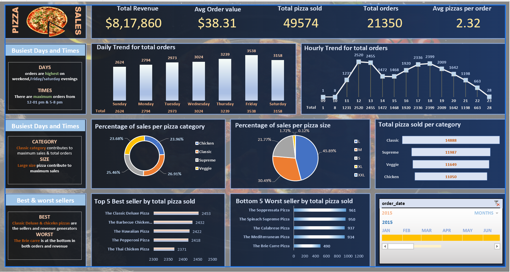

# Pizza_sales_Sql_Excel_Dashboard
# 🍕 Pizza Sales Dashboard (Excel + SQL)

A business intelligence dashboard built in **Excel** and powered by **SQL queries**. It highlights **key revenue metrics, order trends, category/size contributions, and best & worst sellers** to support data-driven decisions for a pizza chain.

---

## 🔥 Key Metrics (via Excel dashboard & SQL)
- Total Revenue
- Average Order Value
- Total Pizzas Sold
- Total Orders
- Average Pizzas per Order

---

## 📈 Insights Covered
- Daily & Hourly Trends for Orders
- Sales % by Pizza Category and Size
- Best and Worst Performing Pizzas

---
🛠️ **Tools Used**

Excel for dashboarding

SQL Server or MySQL for query execution

Pivot Tables & Charts in Excel

🚀 **How to Use**

Open pizza_sales_workbook.xlsx in Excel

Use built-in PivotCharts or visuals to explore insights

Refer pizza_sales_queries.sql to understand query logic

Optionally modify Excel visuals to customize views

## 🧾 SQL Queries Used
Included in `PIZZA SALES SQL QUERIES`, this file covers:
- KPIs (Revenue, Orders, AOV)
- Time-based Trends (hourly, daily)
- Sales % by Category/Size
- Top 5 & Bottom 5 Best Sellers

Example:

'''sql Query for Total Revenue
--SELECT SUM(total_price) AS Total_Revenue FROM pizza_sales;

## 🙋 Author
**Akshay Pitta**  
LinkedIn: https://www.linkedin.com/in/pittaakshay0264/
Email: pittaakshay045@gmail.com
